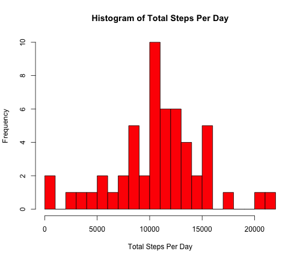
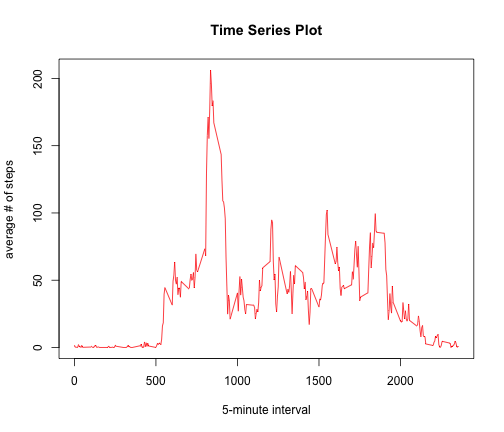
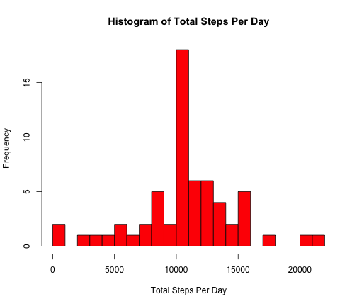
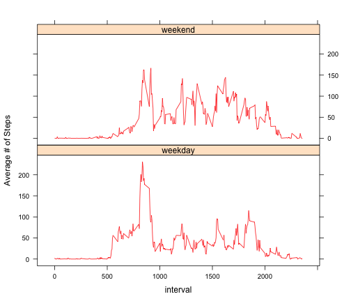

# Reproducible Research: Peer Assessment 1
========================================================

This assignment makes use of data from a personal activity monitoring device. This device collects data at 5 minute intervals through out the day. The data consists of two months of data from an anonymous individual collected during the months of October and November, 2012 and include the number of steps taken in 5 minute intervals each day.

## Loading and preprocessing the data

```r
setwd("~/Desktop/coursera/rep-assign1")
dat <- read.csv("activity.csv", header = TRUE)
dat$date <- as.Date(dat$date)
```


## What is mean total number of steps taken per day?
For this part of the assignment, you can ignore the missing values in the dataset.
We ignore dates with all values missing here by first summing up the steps per day and then omitting NAs. Alternatively, you can omit NAs first when summing, which produces 0 step per day for dates with all values missing.

```r
sumByDate <- tapply(dat$steps, dat$date, function(x) {
    sum(x)
})
sumByDate <- na.omit(data.frame(sumByDate))
```


Histogram of the total number of steps taken each day (ignore the missing values):

```r
hist(sumByDate$sumByDate, main = "Histogram of Total Steps Per Day", xlab = "Total Steps Per Day", 
    col = "red", breaks = 20)
```

 


The mean and median total number of steps per day are:

```r
cat("mean:\t", mean(sumByDate$sumByDate), "\nmedian:\t", median(sumByDate$sumByDate))
```

```
## mean:	 10766 
## median:	 10765
```


## What is the average daily activity pattern?

```r
avgByInterval <- tapply(dat$steps, dat$interval, function(x) {
    mean(x, na.rm = TRUE)
})
avgByInterval <- data.frame(avgByInterval)
avgByInterval$interval <- rownames(avgByInterval)
avgByInterval <- avgByInterval[, c(2:1)]
rownames(avgByInterval) <- NULL
```


Time series plot of average number of steps taken per 5-minute interval (ignore the missing values):

```r
plot(avgByInterval$interval, avgByInterval$avgByInterval, type = "l", col = "red", 
    main = "Time Series Plot", xlab = "5-minute interval", ylab = "average # of steps")
```

 


The 5-minute interval, on average across all the days in the dataset, which contains the maximum number of steps is:

```r
ind <- which(avgByInterval$avgByInterval == max(avgByInterval$avgByInterval))
maxInterval <- as.numeric(avgByInterval$interval[ind])
cat("The 5-minute interval with the max number of average steps across all the days starts at ", 
    maxInterval%/%100, ":", maxInterval%%100, "AM.", sep = "")
```

```
## The 5-minute interval with the max number of average steps across all the days starts at 8:35AM.
```


## Imputing missing values
The total number of missing values in the dataset:

```r
sum(is.na(dat$steps))
```

```
## [1] 2304
```


Fill in all of the missing values in the dataset by replacing NA with the average for that 5-minute interval.
Create a new dataset that is equal to the original dataset but with the missing data filled in.

```r
n <- dim(dat)[1]/dim(avgByInterval)[1]
avgLong <- do.call("rbind", replicate(n, avgByInterval, simplify = FALSE))
datfill <- dat
datfill$steps[is.na(dat$steps)] <- avgLong$avgByInterval[is.na(dat$steps)]
sum(is.na(datfill$steps))
```

```
## [1] 0
```


The total number of steps taken each day: 

```r
sumByDateNoNA <- tapply(datfill$steps, datfill$date, function(x) {
    sum(x)
})
sumByDateNoNA <- data.frame(sumByDateNoNA)
```


Histogram of the total number of steps taken each day (ignore the missing values):

```r
hist(sumByDateNoNA$sumByDateNoNA, main = "Histogram of Total Steps Per Day", 
    xlab = "Total Steps Per Day", col = "red", breaks = 20)
```

 


The mean and median total number of steps per day are:

```r
cat("mean:\t", mean(sumByDateNoNA$sumByDateNoNA), "\nmedian:\t", median(sumByDateNoNA$sumByDateNoNA))
```

```
## mean:	 10766 
## median:	 10766
```


When we replace NA with mean value for that 5-minute interval, we find that the mean stays the same, while the median increases a little bit.

## Are there differences in activity patterns between weekdays and weekends?
Create a new factor variable in the dataset with two levels – “weekday” and “weekend” indicating whether a given date is a weekday or weekend day.

```r
datfill$day <- weekdays(datfill$date)
datfill[datfill$day != "Saturday" & datfill$day != "Sunday", ]$day <- "weekday"
datfill[datfill$day != "weekday", ]$day <- "weekend"
```


A panel plot containing a time series plot:

```r
avgWeekday <- tapply(datfill[datfill$day == "weekday", ]$steps, datfill[datfill$day == 
    "weekday", ]$interval, function(x) {
    mean(x)
})
avgWeekday <- data.frame(avgWeekday)
avgWeekday$interval <- rownames(avgWeekday)
avgWeekday$day <- "weekday"
avgWeekday <- avgWeekday[, c(2, 1, 3)]
rownames(avgWeekday) <- NULL
colnames(avgWeekday) <- c("interval", "steps", "day")

avgWeekend <- tapply(datfill[datfill$day == "weekend", ]$steps, datfill[datfill$day == 
    "weekend", ]$interval, function(x) {
    mean(x)
})
avgWeekend <- data.frame(avgWeekend)
avgWeekend$interval <- rownames(avgWeekend)
avgWeekend$day <- "weekend"
avgWeekend <- avgWeekend[, c(2, 1, 3)]
rownames(avgWeekend) <- NULL
colnames(avgWeekend) <- c("interval", "steps", "day")

avgByDay <- rbind(avgWeekday, avgWeekend)
```


Time series plot of average number of steps taken per 5-minute interval:

```r
library(lattice)
avgByDay$day <- as.factor(avgByDay$day)
avgByDay$interval <- as.numeric(avgByDay$interval)
xyplot(steps ~ interval | day, data = avgByDay, type = "l", layout = c(1, 2), 
    col = "red", ylab = "Average # of Steps")
```

 


